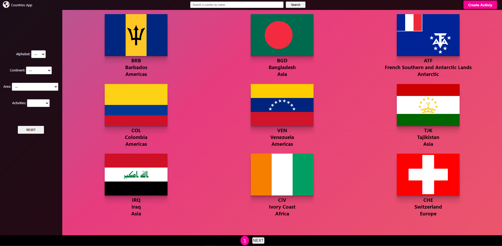
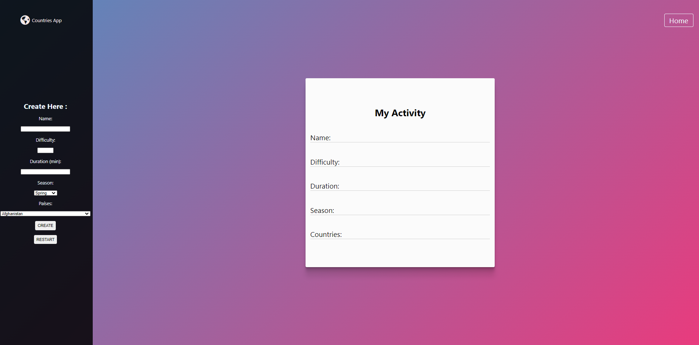
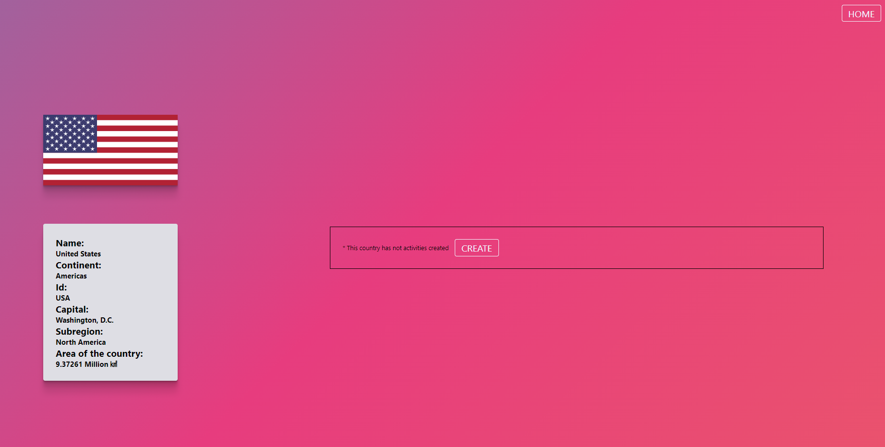
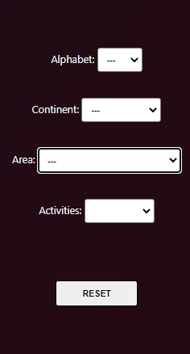

<p align='left'>
    
</p>

# Individual Project - Henry Countries

<p align="center">
  
</p>

## Descripción

<p>Este es el proyecto individual realizado durante la etapa de Labs de <strong>Henry.</strong> Es una SPA (Single Page Application), en la que se utiliza React, Redux, Express, una base de datos con ProgreSQL y una API (<a href="https://rawg.io/">rawg</a>) para obtener la info en la web principalmente. En la app se pueden hacer consultas a la API externa y a la DB, crear videogames, filtrar por género y pertenencia, tambien se le puede aplicar un ordenamiento, tanto alfabético como por rating.</p>

## Dependencias y programas usados

<p>Durante el proyecto, se usaron las sigs tecnologías:</p>

- Node v12.21.0
- Npm v7.20.3
- PSQL v13.4
- Express v4.17.1
- Sequelize v6.3.5
- Firefox 93.0
- Brave 1.30.87

<p>Y muchas más dependencias, consultar los package.json de la ruta <strong>/api</strong> y <strong>/client.</strong> </p>

## Instrucciones para utilizar el proyecto

- Clonar o forkear el repositorio
- Obtener una api-key desde <a href="https://rawg.io/">rawg</a>

### <u>Configurando la DB</u>

Crear un archivo <strong>.env</strong> en la carpeta <strong>/api</strong> con los sigs parámetros:

```
DB_USER=usuariodepostgres
DB_PASSWORD=passwordDePostgres
DB_HOST=localhost
API_KEY=api-key
```

Reemplazar usuariodepostgres y passwordDePostgres con tus propias credenciales para conectarte a postgres, y colocar en API_KEY la api creada anteriormente.

Debe ser necesario crear la DATABASE <strong>Videogames</strong> en ProgreSQL.

Una vez realizado, ya puede realizar <strong> npm install </strong> en la carpeta <strong>API</strong>, para que se instalen todas las dependencias necesarias.

Para poner en línea el servidor, ejecutar <strong>npm start</strong> .

### <u>Configurando el Front</u>

Para el front no se requieren de configuraciones adicionales. Ejecutar <strong>npm install</strong> en la carpeta <strong>Cliente</strong> y luego <strong>npm start</strong> para poner en línea el servidor web.

<br />

## Presentación y funcionalidades

### <u>Home</u>



Pantalla principal de la app. Se muestran los primeros 9 resultados que devuelve la api externa, junto con el resto de países que ya se encuentren en la base de datos. Incluye una navbar con una barra de búsqueda por coincidencia de carácteres (pueden utilizarse mayúsculas o minúsculas indistintamente). También, una barra lateral, con la posibilidad de aplicar filtros, tanto a los resultados por default, como a los resultados de la búsqueda en general. Las búsquedas cuentan con un paginado en su parte inferior.

<br />

### <u>Create</u>



Pantalla de creación de una actividad turística. Un formulario controlado, en donde todos los campos son requeridos para la creación del formulario. Luego de la creación, sale un pequeño Popup indicando el resultado de la creación.

<br />

### <u>Country detail</u>



Pantalla con el detalle del país seleccionado. Se muestran más detalles que en la pantalla principal, como el continente al cual pertenece, la capital del mismo, y el área de este país. También acá podremos ver si ese país está asociado a alguna actividad turística. En caso de ser negativo, este invitará al usuario a crearla.

<br />

### <u>Filters</u>



Funcionalidad de filtros. Se puede filtrar por Continente, por actividad turística, por mayor o menor área y aplicar un ordenamiento alfabético (A-Z o Z-A).

<br />

### <u>Pages</u>


Funcionalidad de paginado. Es posible avanzar por páginas, tanto para mostrar todos los resultados, como para mostrar los filtros. La cantidad de países por página es de 9.

<br />

### <u>Responsive</u>

La web NO esta configurada para funcionar responsivamente.


